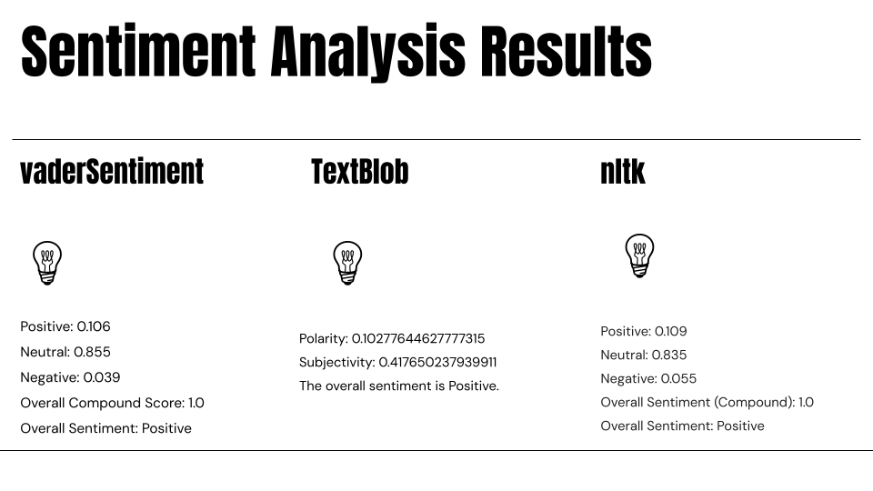
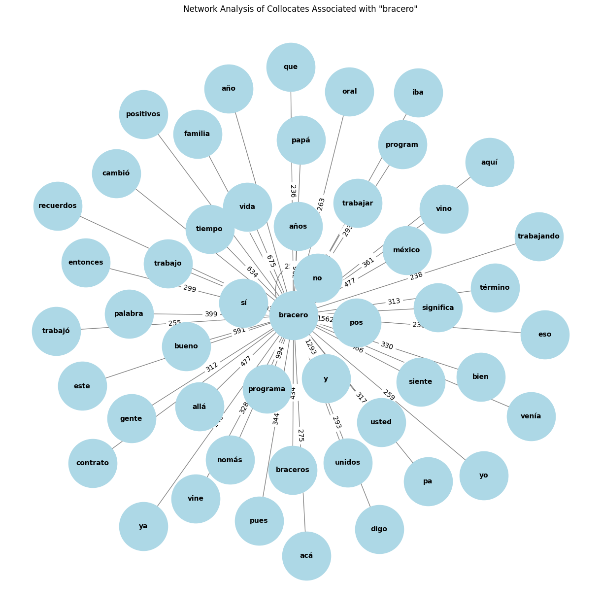
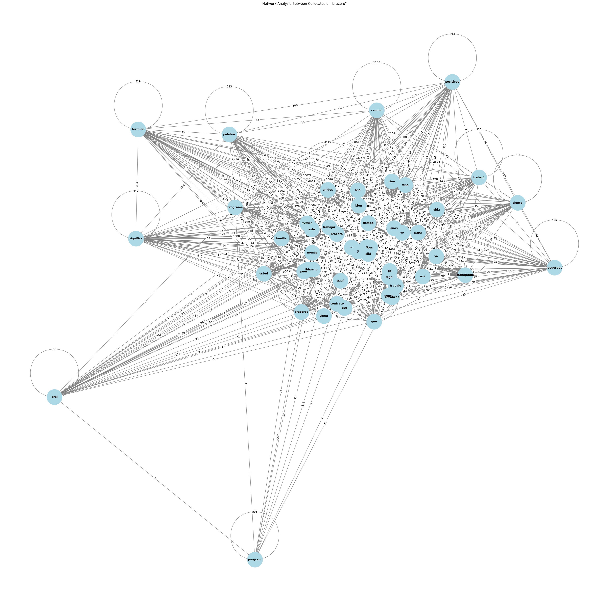

# Sentiment and Network Analysis of Testimonials (Interviews)

## Sentiment Analysis of Testimonials

### Pre-processing Steps

1. Gathering the PDF files of testimonials and turning them into TXT files.
2. Cleaning the TXT files using regular expressions. (Google Colab)
3. Translating the Spanish corpus into English using DeepL. This step has a risk of lowering the accuracy of the result, but was inevitable as currently available Python libraries for sentiment analysis weren’t quite capable of processing large amounts of Spanish data (The script either ran for hours or output errors with tags such as “translate” when I ran it with the Spanish parts without translating them into English).

### Testing with Python NLP Libraries

Three libraries were used to cross-check the results:

#### 1. VaderSentiment
- **Positive:** 0.106  
  This indicates that approximately 10.6% of the text consists of positive emotions or words.
- **Neutral:** 0.855  
  85.5% of the text is neutral, indicating it doesn't express strong emotions, whether positive or negative. It conveys plain information.
- **Negative:** 0.039  
  This indicates that 3.9% of the text has negative emotions or words.
- **Overall Compound Score:** 1.0 (Positive) 
  The compound score ranges from -1.0 to 1.0. Neutral words, which make up 85.5% of the analyzed text, do not influence the compound score either positively or negatively. Although only 10.6% of the words are classified as positive, if these words carry a high intensity it can further contribute to the overall sentiment being calculated as positive. Also, if positive words face little opposition from negative sentiment, it can lead to the overall compound score to lean towards being overall positive.
  

#### 2. TextBlob
- **Polarity:** 0.10277644627777315  
 'Polarity' scores range from -1.0 to 1.0; -1.0 represents very negative sentiment, 0.0 indicates neutral sentiment, and 1.0 signifies very positive sentiment. A score of 0.10277644627777315 suggests that the text has a moderately positive sentiment.
- **Subjectivity:** 0.417650237939911  
  ‘Subjectivity’ scores range from 0.0 to 1.0, with 0.0 representing an objective recounting of facts rather than feelings, while 1.0 representing complete subjectivity reflecting opinions or feelings. 0.417650237939911 indicates that the text is somewhat balanced but leans slightly towards objectivity.
- **The overall sentiment is Positive.**

#### 3. Nltk
- **Positive:** 0.109 
 10.9% of the text is made up of positive words
- **Neutral:** 0.835  
83.5% of the text is neutral.
- **Negative:** 0.055   
5.5% of the text is made up of negative words.
- **Overall Compound Score:** 1.0 (Positive)

### Reflections

The major limitation of the above sentiment analysis is that it categorizes the text into either positive or negative, thus oversimplifying the complexity of human emotional experience. This binary categorization overlooks the nuances of words, limiting the output to capture a broader range of emotions. However, this seeming limitation can conversely serve as a meaningful warning towards statistical analyses of human experiences. The above result indicating there is more positive sentiment to the testimonials than negative sentiment, is contrary to our existing understanding that the Bracero Program involved mistreatment of the participants. This provokes us to think about how statistical examination of human experience can undermine the severity of existing but not statistically overarching numbers of unfair treatment. In other words, it raises important questions about whether a statistical representation can be considered a “fair” representation.

---

## Network Analysis of Testimonials

### Graphic Visualization of Words Connected to "Bracero"

Next, I wanted to explore how words relate to the keyword "bracero" and visualize a network displaying these connections. Key tools used in this process were libraries NetworkX and Matplotlib. My window size was 5, defining connection to “bracero” as appearing within 5 words of distance. Although the script incorporated Nltk library’s function of removing stopwords, words such as “y,”  “que,” “este,” etc. still remained, which is the limitation of current NLP libraries. The result below puts the keyword “bracero” in the center, and the more frequent a word appears in the context of “bracero” the closer it is located toward the center of the graph. The numbers on the lines indicate the number of collocations, the number being higher meaning more frequent collocation. 

  

### Network of Collocates

  Then, I did an additional analysis examining the relationships between the collocates to uncover central themes in the text. The script first identifies the 50 most frequent collocates of "bracero," and then it checks if any of these 50 words are closely put together (my window size was 5 words before and 5 words after). If, as an example, "trabajar" and "bien" show up together so-and-so times in different parts of the text, it's recorded as a connection between these two words with a strength of so-and-so number. The strength, or in other words, “weight” is indicated as numbers on the edges/connecting lines of the graph visualization. If a word appears near the center of the graph, it generally indicates that the word is closely connected to many other words in the 50-collocates list. An interesting observation from the results is that positive words such as “bien” and “bueno” are located towards the center of the network. Since these words are connected to many other words, there is a high probability that this word represents a key theme or bridging concept in the text. “Bien” and “Bueno” being located towards the center aligns with the sentiment analysis results that analyzed the corpus as having an overall positive sentiment. 
  

  

